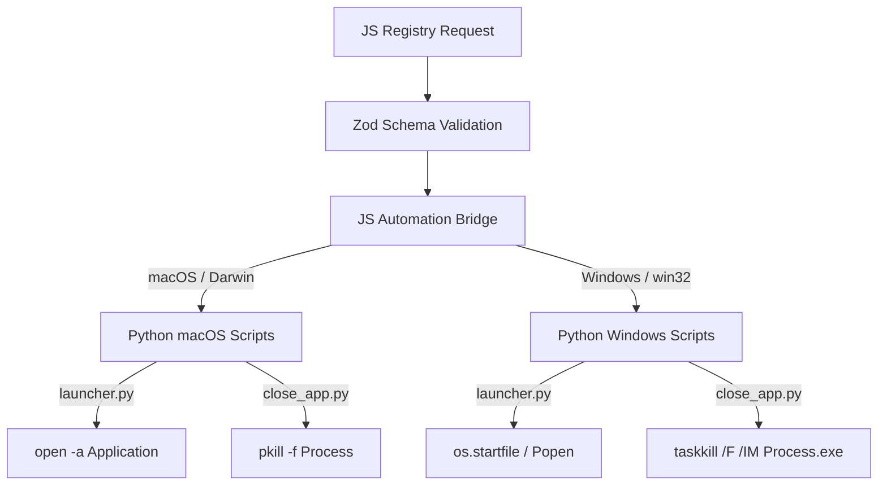

# Medha AI - App Automation Architecture Guide

This guide details the complete flow of Medha AI's application launching and closing system, and outlines exactly where to update the code to add support for any new application in the future.

---

## 🛠 Flow Diagram



---

## 📂 Step-by-Step Integration Guide

When you want to add a new app (e.g., `"new_app"`), follow these four steps:

### 1. Update macOS Scripts (if supporting macOS)

* **Launcher:** `python/automation/macos/launcher.py`
  Add an `elif` block for your app to open it using the native `open` command.
  ```python
  elif app in ["new_app", "newApp"]:
      subprocess.Popen(["open", "-a", "Actual macOS App Name"])
  ```
  *(Tip: You can find the exact name under `/Applications` on your Mac, e.g. "Google Chrome", "Spotify", "Music", "Slack")*

* **Closer:** `python/automation/macos/close_app.py`
  Add the app's identifiers to the `APP_MAP` dictionary, mapping it to the native process name closed by `pkill`:
  ```python
  APP_MAP = {
      ...
      "new_app": "Actual macOS Process Name",
      "newApp": "Actual macOS Process Name",
  }
  ```

---

### 2. Update Windows Scripts (if supporting Windows)

* **Launcher:** `python/automation/windows/launcher.py`
  Add an `elif` block to launch the application. We recommend trying to open the app's URI protocol first (if available), then falling back to its installation path.
  ```python
  elif app in ["new_app", "newApp"]:
      import os
      try:
          os.startfile("new_app_protocol:") # E.g. "spotify:", "slack:"
      except Exception:
          # Fallback to direct path or general cmd start
          subprocess.Popen(["cmd", "/c", "start", "new_app"], shell=True)
  ```

* **Closer:** `python/automation/windows/close_app.py`
  Add the app's identifiers to `PROCESS_MAP` to terminate it via `taskkill`:
  ```python
  PROCESS_MAP = {
      ...
      "new_app": "new_app.exe",
      "newApp": "new_app.exe"
  }
  ```

---

### 3. Update Shared Configuration (Optional)

* **Apps Config:** `python/automation/common/apps.py`
  Keep the shared documentation map clean and updated:
  ```python
  "new_app": {
      "windows_process": "new_app.exe",
      "macos_process": "Actual macOS Process Name"
  }
  ```

---

### 4. Restrict or Validate App Names (Optional)

* **Zod Validation Schema:** `packages/schemas/open-app.schema.js`
  By default, `OpenAppSchema` takes any string (`z.string()`). If you wish to restrict the allowed inputs to specific apps only, you can uncomment/change the schema to use an enum:
  ```javascript
  export const OpenAppSchema = z.object({
    app: z.enum([
      "chrome",
      "vscode",
      "spotify",
      "apple_music",
      "new_app"
    ])
  });
  ```
